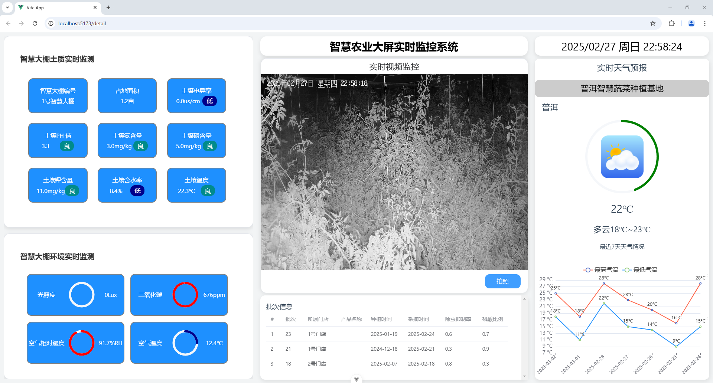

#### 安装教程

1. 创建一个空目录，用git克隆项目到该目录下
2. 打开WebStorm
3. 打开克隆的项目
4. 运行npm install 或 pnpm install 安装所需插件
5. 运行该项目配套的后端Springboot程序
6. 确认插件下载完成，后端启动后，可以使用npm run dev运行该项目
7. 打开命令行中显示的项目网址
8. 输入测试用户名：root，密码：admin

#### 使用说明

1. 项目使用Vue+Elementplus+Echarts的技术栈
2. 该项目假设只有1个大棚，每个大棚只有1个摄影机
3. 项目内天气信息写死，其他信息都通过axios与后端交互，从数据库中读出
4. 如果没有登陆直接打开detail，则会被路由守卫拦截，返回登陆页面，反之在详情页面已登录已有有效token的状态下，如果手输地址返回登陆页面，则会自动重新返回详情页面，而不是重新登陆。
5. 土质监测使用了状态标注，不同状态有不同颜色，状态和颜色信息从后端获取。环境监测用来进度环的数据表示方法，进度环的进度和颜色从后端获取。批次显示使用了表的数据表示方法，数据从后端的数据库中获取。历史天气使用了折线图的数据表示方法，数据写死在前端。
6. 运行效果：

- 「株式会社　腾梁技研」 does not exist.
- Zhuohong Cun © All Rights Reserved